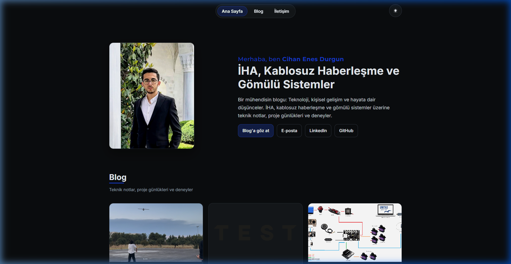

<div align="center">

# cihanenesdurgun.com - Blog & Yönetim Paneli

**Bağımsız Arayüz Mimarisi • Derinlemesine Güvenlik • Taşınabilir JSON Altyapısı**

[]()
[]()
[]()
[]()

*Modern, ultra-hızlı ve bütünüyle bağımsız bir kişisel blog yönetim sistemi.*  
Ağır SPA framework'leri olmadan Vanilla JS ve Express ile %100 SEO uyumlu ve performans odaklı geliştirilmiştir.

<br>



</div>

---

## ⚡ Neden Bu Mimari? (Executive Summary)

Bir Full Stack Developer olarak bu projede amacım; bir blog sisteminin ne kadar hafif, güvenli ve taşınabilir olabileceğini kanıtlamaktır. Sistemin mimarisinde **RDBMS (SQL) veritabanı kasıtlı olarak kullanılmamıştır**. Tüm veriler lokal JSON dosyaları ve Markdown (`.md`) üzerinde tutularak, projenin en ucuz paylaşımlı sunuculardan (cPanel) en profesyonel VPS'lere kadar **kurulum gereksinimi duymadan** direkt taşınabilmesi hedeflenmiştir (Portability).

Sistem, arkasında çalıştırdığı gelişmiş algoritmalar sayesinde ağır paketlere mecbur kalmadan bir CMS'in sunduğu tüm olanakları güvenlikten ödün vermeden sunar.

---

## 🛠️ Tech Stack & İskelet

Uygulamanın teknoloji yığını tamamen sadelik ve tam kontrol (Vanilla) üzerine kurulmuştur:

- **Frontend:** HTML5, CSS3 (Variables & Glassmorphism), Vanilla JavaScript (ES6+ Modüler)
- **Backend Sunucusu:** Node.js, Express.js (REST API mimarisi)
- **Veri & Asset Yönetimi:** `fs-extra` ile Dosya tabanlı (JSON + MD) kalıcı mimari, Multer
- **Kimlik Doğrulama:** JWT (JSON Web Tokens) tabanlı Session Guarding, `bcryptjs`
- **Siber Güvenlik:** `express-rate-limit` (DDoS), `DOMpurify` & `sanitize-html` (XSS), Magic-Bytes validation (Reverse Shell koruması)

---

## ✨ Yetenekler & Özellikler

### 🌐 İstemci Yüzü (Frontend)
- **Zero-Dependency UI:** React, Vue veya jQuery olmadan sıfırdan yazılmış akıcı mikro-animasyonlar.
- **Native Tema Motoru:** Sistem tercihini algılayabilen ve CSS değişkenlerini anında manipüle eden Dark/Light Mode.
- **SEO Mükemmelliği:** Otomatik generate edilen ve pinglenen `sitemap.xml` ile `RSS Feed` (Podcast/RSS Okuyucuları için tam uyum).
- **Responsive Grid:** Mobil, tablet ve 4K ekranlara kadar esneyebilen kusursuz duyarlı tasarım.

### 🔐 Yönetim Merkezi (Admin Control Center)
- **Canlı (Live) Markdown Editör:** Senkronize scroll (kaydırma) özellikli, anında native olarak ayrıştırılabilen çift yönlü Markdown editör.
- **Zayıflıksız Asset Kütüphanesi:** Sürükle-bırak fotoğraf yükleme desteği ve yüklenen `.jpg/png` dosyalarının sadece uzantısında (extension) değil, **Buffer seviyesinde İLK 4 BYTE (Magic Signature)** okumasıyla doğrulanması.
- **Grafiksel İstatistikler:** Makale bazlı anlık tıklanma ve etkileşim analizleri.

---

## 🛡️ "Defense in Depth" (Derinlemesine Savunma)

Bu proje sıradan bir web sitesi değil, aynı zamanda siber güvenliğe (SecOps) duyulan saygının bir ürünüdür. OWASP standartlarına sıkı sıkıya bağlı kalınmıştır:

1. **Agresif Rate-Limiting:** Brute-force denemelerinde saldırganın IP'si cache üzerinden geçici olarak düşürülür (Reject). Admin paneli rotaları için çok daha hassas sınırlandırıcılar mevcuttur.
2. **XSS / AST Sanitization:** Veriler API'ye ulaştığında ve DOM'a (innerHTML) basılmadan hemen önce mutasyon korumasından geçirilir. Injection yolları tamamen sterilize edilmiştir.
3. **Session Revocation System:** Token (JWT) tabanlı sistemlerdeki "kapatılamayan oturum (stateless)" zaafiyetini gidermek adına, server-side memory tabanlı bir Session Guardian devrededir.
4. **Stack Trace Masking:** Sistem hataları (HTTP 500) patladığında, üretim modunda (Production) saldırganlara sistem mimarisini belli edebilecek "Hata Yolu (Stack Trace)" sızdırılmaz.

>> *Detaylı Security Audit raporunu okumak için [docs/reports/security-audit-2026-02.md](./docs/reports/security-audit-2026-02.md) dosyasına bakabilirsiniz.*

---

## 📦 Local'de Başlangıç (Quick Start)

Geliştirme ortamına (Dev Environment) kurmak sadece birkaç saniyenizi alır.

**1. Repoyu lokal makinenize çekin:**
```bash
git clone https://github.com/cihanenes/personal-site.git
cd personal-site
```

**2. Bağımlılıkları derleyin:**
```bash
npm install
```

**3. Çevresel (Environment) Kurulumu:**
`env.example` dosyasını `.env` olarak kopyalayın ve zorunlu değerleri doldurun:
```bash
cp env.example .env
```
```env
JWT_SECRET=          # 32+ karakter, aşağıdaki komutla üretin
BCRYPT_SALT_ROUNDS=12
NODE_ENV=development
DEFAULT_ADMIN_PASSWORD=   # 12+ karakter, admin oluşturmak için
```
Güvenli değerler üretmek için:
```bash
node -e "console.log(require('crypto').randomBytes(32).toString('hex'))"   # JWT_SECRET
node -e "console.log(require('crypto').randomBytes(18).toString('base64url'))"  # şifre
```
> `.env` gitignore'dadır ve öyle kalmalıdır. Repo public; buraya yazılan gerçek değerler
> asla commit'lenmemelidir. Ayrıntı: [`docs/security/env-information.md`](./docs/security/env-information.md)

**4. Admin kullanıcısını oluşturun:**
```bash
npm run setup:users
```

**5. Sunucuyu Ateşleyin:**
```bash
npm run dev
```

Erişim linkleri:
- **Site:** `http://localhost:3000`
- **Yönetim:** `http://localhost:3000/admin/login.html`

*(Not: Ortam değişkenleri ve cPanel gibi sunuculara yükleme rehberi için [Deployment Docs](./docs/deployment/) dizinini okuyabilirsiniz.)*

---

## 📁 Dosya ve Mimari Ağacı

Ölçeklenebilirlik (Scalability) açısından proje sınırları mutlak çizgilerle çekilmiştir:

```text
personal-site/
├── admin/                 # Yetki (Token) gerektiren, kapalı SPA Yönetim Arayüzü
├── content/               # No-SQL Data: .md dosyaları ve metadata map'i (posts.json)
├── data/                  # Auth, Session logları ve Theme konfigürasyon dosyaları
├── docs/                  # Diagnostic raporları, analizler ve DevOps rehberleri
├── images/                # Statik medya (Upload edilen cover resimleri vb.)
├── markdown-editor/       # Markdown'ı parse edip editleyen core logic UI
├── src/                   # Halka açık arayüzün (Frontend) JS/CSS statikleri
└── server.js              # Express Backend Kernel'i
```

---

## 🤝 Katkıda Bulunma (Contributing) & Lisans

Bu proje bir gösterim (Showcase) projesidir ve açık kaynak (MIT License) topluluk ruhuna uygun olarak dağıtılmaktadır. Herhangi bir güvenlik açığı veya Bug (hata) bulursanız `Pull Request` veya `Issue` açmaktan çekinmeyin!

<div align="center">
  <b>Cihan Enes Durgun</b>
  <br>
  <a href="cihanenesdurgun@hotmail.com">E-Posta</a> |
  <a href="https://www.linkedin.com/in/cihanenesdurgun/">LinkedIn</a>
</div>
